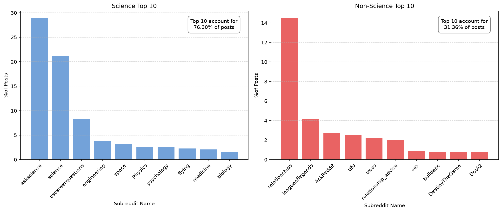

## Project Report Template

> This repository serves as a template for your project reports as part of the Document Analysis lecture. To set up your project report as a webpage using GitHub Pages, simply follow the steps outlined in the next chapter.
>
>**Some Organizational Details:** Get creative with your project ideas! Just make sure they relate to Natural Language Processing and incorporate this specified dataset: [Link to data](https://huggingface.co/datasets/webis/tldr-17), [Link to paper](https://aclanthology.org/W17-4508.pdf). Submissions should be made in teams of 2-3 students. Each team is expected to create a blog-style project website, using GitHub Pages, to present their findings. Additionally, teams will deliver a lightning talk during the final lecture to discuss their project. Add all your code, such as Python scripts and Jupyter notebooks, to the `code` folder. Use markdown files for your project report. [Here](https://docs.gitlab.com/ee/user/markdown.html) you can read about how to format Markdown documents. 
>
>Have fun working on your project! 🥳

## Setup The Report Template

Follow this steps to set up your project report:

1. **Fork the Repository:** Begin by creating a copy of this repository for your own use. Click the `Fork` button at the top right corner of this page to do this.

2. **Configure GitHub Pages:** Navigate to `Settings` -> `Pages` in your newly forked repository. Under the `Branch` section, change from `None` to `master` and then click `Save`.

3. **Customize Configuration:** Modify the `_config.yml` file within your repository to personalize your site. Update the `title:` to reflect the title of your project and adjust the `description:` to provide a brief summary.

4. **Start Writing:** Start writing your report by modifying the `README.md`. You can also add new Markdown files for additional pages by modifying the `_config.yml` file. Use the standard [GitHub Markdown syntax](https://docs.github.com/en/get-started/writing-on-github/getting-started-with-writing-and-formatting-on-github/basic-writing-and-formatting-syntax) for formatting. 

5. **Access Your Site:** Return to `Settings` -> `Pages` in your repository to find the URL to your live site. It typically takes a few minutes for GitHub Pages to build and publish your site after updates. The URL to access your live site follows this schema: `https://<<username>>.github.io/<<repository_name>>/`

***

# Project Title

_Group members: Ludwig Kunz, Marco Stöhr, Robert Seidel

## Introduction
Reddit is a large social media platform organized into topic-specific communities called subreddits, in which users post and discuss content in a wide range of registers and styles. It has driven our interest in suspecting that language use varies systematically along dimensions such as formality, self-reference, and informational density, depending on communicative purpose and audience. Scientific and academic discourse is typically associated with the
formal, informational end of this spectrum, whereas everyday social media discourse tends toward more informal, personally biased involved language use. This raises the question of whether science-related subreddits exhibit systematically different linguistic patterns compared to non-science subreddits? In particular regarding readability, self-reference, affective language, and lexical register, and whether these differences already emerge in short TL;DR summaries or only in the original posts. We investigate this by comparing content and summary texts from a balanced sample of science and non-science subreddits using a set of manually constructed linguistic features, and by testing how well these features predict a post's subreddit category. 

## Dataset & Dataset Construction
The corpus used for analysis is the Webis-TLDR-17 dataset [webis/tldr-17](https://huggingface.co/datasets/webis/tldr-17), introduced by Völske et al. (2017), who mined Reddit posts and their authror written TL;DR summaries for automatic summarization research. The full corpus comprises 29,651 unique subreddits. 
We began by identifying science-related content. Therefore, we compiled a reference list of 365 science subreddits (spanning 8 topic areas and 32 subtopics) from the r/ScienceSubreddits community wiki. Matching this list against the subreddits present in the corpus, we identified 132 science subreddits, contributing 41,832 posts. To construct a balanced binary classification task, we randomly sampled an equal number of posts (41,832) from the remaining 3,806,498
non-science posts (seed=42), yielding a balanced sample of 83,664 posts.
The data cleaning process involved the removal of duplicate content, posts with implausible readability score (Flesch-Kincaid Grade ≥ 30, indicating markup/list artifacts), summaries shorter than 3 words, and posts with a low alphabetic-character ratio (<0.5). The final dataset consists of 79,179 posts of which 50.5% are non-science related and, 49.5% are science related. Dataset balance was
preserved throughout the cleaning process. On average, content posts comprise 295 words (median 207, max 6,308) and summaries 33 words (median 21, max 2,576), corresponding to a mean compression ratio of 0.157 (median 0.108).


*Figure 1: Share of posts contributed by the ten most frequent subreddits, separately for science and non-science subreddits.*


## Methods
### Setup 


Outline the tools, software, and hardware environment, along with configurations used for conducting your experiments. Be sure to document the Python version and other dependencies clearly. Provide step-by-step instructions on how to recreate your environment, ensuring anyone can replicate your setup with ease:

```bash
conda create --name myenv python=<version>
conda activate myenv
```

Include a `requirements.txt` file in your project repository. This file should list all the Python libraries and their versions needed to run the project. Provide instructions on how to install these dependencies using pip, for example:

```bash
pip install -r requirements.txt
```

### Experiments

### Feature Engineering
To investigate the linguistic properties of the Reddit comments and their respective TL;DR summaries, we computed a set of features across seven categories: readability, compression ratio, profanity, sentiment, subjectivity, named entity retention, and pronoun usage. All features were computed seperately for the original comment (content column) and the corresponding summary, which also allowed us the inspect both absolute values and relative differences between two texts.
Some of the features are known for their lack of capacity to detect sarcasm and irony (e.g. VADER or better_profanity). In order to balance precision and output of the scores, we still relied on simpler and more intuitive (and therefore more interpretable models). 

### Cosine Similarity
As the primary quality measure for TL;DR summaries, we computed the cosine similarity between sentence embeddings of content and summary. Embeddings were generated using the all-MiniLM-L6-v2 model from the sentence-transformers library (Reimers & Gurevych, 2019), a lightweight model fine-tuned for semantic similarity tasks. Cosine similarity ranges from -1 to +1, where higher values indicate greater semantic overlap. Negative values, observed in XXX cases, indicate that content and summary are semantically divergent – qualitative inspection confirmed these correspond to cases where the TL;DR contains a joke, an emotional reaction, or an unrelated opinion rather than a genuine summary.

### Readability
We used four different approaches to quantify linguistic complexity of the comments and summaries. Readability metrics are usually based on surface-level properties such as sentence length, word length, and syllable counts. Four different readability scores were initially computed, of which two were retained for further analysis.
The Flesch Reading Ease score (Flesch, 1948) combines average sentence length and average number of syllables per word into a score ranging from 0 to 100, where higher values indicate easier readability. The Flesch-Kincaid Grade Level (Kincaid et al., 1975) uses the same underlying variables but maps them to a US school grade level, making results more intuitively interpretable. The Gunning Fog Index (Gunning, 1952) differs conceptually by counting complex words, defined as words with three or more syllables, rather than average syllable counts. This makes it particularly sensitive to domain-specific vocabulary, which is relevant for distinguishing scientific from general Reddit content. Finally, the Coleman-Liau Index (Coleman & Liau, 1975) departs from syllable-based approaches entirely by counting characters per word and sentences per 100 words, making it robust to abbreviations and acronyms that are common in informal online text.
Prior to model building, we examined pairwise correlations among the four metrics. Flesch-Kincaid Grade and Gunning Fog showed a near-perfect correlation of 0.98, indicating redundancy. To avoid multicollinearity, we retained only Gunning Fog and Coleman-Liau as complementary representatives of two distinct measurement approaches. For both remaining readability scores, higher values indicate a more complex language and therefore a higher difficulty regarding the readability.


*Figure 2: Pairwise correlation of the four candidate readability metrics on content text. Flesch-Kincaid Grade and Gunning Fog Index are near-perfectly correlated (r = 0.98), motivating the exclusion of Flesch-Kincaid Grade from further analysis.*


### Compression Ratio
To account for the effect of strong shortenings of summaries compared to their original comments, we computed a compression ratio, representing the ratio of the length of the summary divided by the length of the original content.

### Profanity
Profanity was measured using a lexicon-based approach based on the better_profanity library (Nguyen, 2018), checking whether a comment or summary contains any word from a predefined list of profane terms. The resulting feature is binary, indicating the presence or absence of profanity in a given text. 

### Sentiment
Sentiment was measured using VADER (Valence Aware Dictionary and sEntiment Reasoner), a lexicon-based sentiment analysis tool specifically designed for social media text (Hutto & Gilbert, 2014). VADER produces a compound score ranging from -1 (most negative) to +1 (most positive), which aggregates positive, negative, and neutral sub-scores with adjustments for capitalization, punctuation, and degree modifiers. Its social media orientation makes it particularly suitable for Reddit data.

### Subjectivity
Subjectivity scores were computed using TextBlob (Loria, 2013), which draws on the Pattern lexicon (De Smedt & Daelemans, 2012) to assign each word a manually annotated subjectivity score between 0 and 1, where 0 represents objective factual language and 1 represents strongly subjective opinion language. The document-level score is computed as a weighted average over all lexicon-matched words. A relevant limitation for our dataset is that scientific intensifiers such as "significantly" or "strongly" may be scored as subjective despite occurring in factual contexts, potentially biasing subjectivity scores upward for science-domain content.

### Named Entity Retention Rate
To assess how faithfully TL;DR summaries preserve the informational content of the original comment, we computed an Entity Retention Rate (ERR). Named entities were extracted from both content and summary using spaCy (Honnibal & Montani, 2017). The ERR is defined as the proportion of entities identified in the content that also appear in the summary. A score of 0 indicates that no entities were retained, while a score of 1 indicates complete retention. Comments containing no named entities were assigned the median ERR of the dataset. This strict exact-match approach proved conservative in practice (the median ERR was 0.0) suggesting that TL;DR authors rarely reproduce entity mentions verbatism.

### Pronoun Usage
By hypothesizing that personal, self-referential language is more common in
non-science subreddits, we measured the rate of first-person singular
pronouns (I, me, my, mine, myself) that is commonly referred to as "I-words" in
language research (Pennebaker & King, 1999), and was implemented via regular expression matching. This is deliberately narrower than personal pronouns in the
grammatical sense, which would also include we/you/he/she/they. Both the content and summary pronoun rate showed similar means (content m = 0.049; summary m = 0.039) but differed in their medians. The summary pronoun rate median is 0, indicating that more than half of the summaries contain no first-person singular pronoun at all — consistent with the expectation that summaries adopt a more neutral, less personal register.

### Statistical Analysis
Prior to the model building, all features were standardized (mean = 0, sd = 1) to ensure comparable coefficent magnitudes. Statistical analysis was conducted at α = 0.05. We then checked pairwise correlations among all engineered features to identify redundancy and potential multicollinearity.

We modeled subreddit category science vs non-science using logistic regression comparing three feature sets: content-only, summary-only, and a coombined full model including content and summary with cosine similarity and entity retention rate. Predictive performance was evaluated via 10-fold stratified cross-validation, while preserving class balance in every fold using scikit-learn's LogisticRegression (lbfgs solver, L2 penalty, max_iter=1000), reporting accuracy, precision, recall, F1, and ROC-AUC as means across folds.
To interprete feature contributions, we additionally fit standardized logistic regression models (statsmodels, Newton-Raphson MLE, converged within 6
iterations for all three feature sets) on the full sample, reporting coefficients with 95% confidence intervals and p-values. Furthermore, we compared the full model to both individual models via Likelihood Ratio test to investigate, if the full model does show significant explanatory power.

## Results and Discussion

### Predictive Power

Analysis has revealed that the compression of the summaries for the most part reduces domain specific linguistic signal available for classification. Content alone does explain roughly three times as much variance as the summary alone (Pseudo-R² 0,251 vs. 0,091), and consistently outperforms it in cross-validated predictive metrics (Table 1).

**Table 1: Cross-validated performance by feature set / model**

| Model | Accuracy | Precision | Recall | F1-Score | ROC-AUC |
|---|:--------:|:---------:|:------:|:--------:|:-------:|
| Logit (Summary) | 0.656 | 0.634 | 0.723 | 0.675 | 0.708 |
| Logit (Content) | 0.750 | 0.750 | 0.742 | 0.746 | 0.825 |
| Logit (Full) | 0.755 | 0.755 | 0.747 | 0.751 | 0.832 |
| BERT (Content) | 0.95 | 0.946 | 0.954 | 0.95 | 0.989 |
| BERT (Summary) | 0.86 | 0.804 | 0.952 | 0.872 | 0.946 |

Adding summary and cross-text features (cosine similarity, entity retention) to the content-only model yields only a small improvement in predictive metrics
(ΔAccuracy = 0.005, ΔROC-AUC = 0.007), but this improvement remains significant in the Likelihoood-Ratio-Test (LR=1514,9, df=9, p≈0). Having the small effect sizes in mind and the large sample size, this leads to the cautious interpreation that summary features do carry additional information, although their practical contribution beyond the content-only features remains modest.

### Predictors

A handful of features has revealed dominant contribution to the content-only model's prediction (Figure 1, Table 2). Lexical complexity, measured via the Coleman-Liau Index, shows the strongest effect (β = 0.82, OR = 2.28, 95% CI [2.21, 2.34]): a
one-standard-deviation increase in lexical complexity more than doubles the
odds of a post belonging to a science-related subreddit. First-person singular pronoun rate shows the second-strongest effect, in the opposite direction (β = -0.61, OR = 0.55, 95% CI [0.54, 0.56]) — more self-referential language is associated with roughly half the odds of being science-related, consistent with our hypothesis that personal, narrative language use is more characteristic of non-science subreddits. Content length is also negatively associated with the science label (β = -0.54, OR = 0.59), potentially reflecting a tendency toward longer, more narrative personal posts in non-science subreddits. Profanity (β = -0.27, OR = 0.76) and subjectivity (β = -0.11, OR = 0.90) show smaller negative effects, suggesting that
science-related content tends to be more objective and less vulgar in tone. Sentiment and Gunning Fog show negligible, non-significant effects once Coleman-Liau is included in the model (95% CIs include 1 on the odds scale), indicating they add little independent information given the other features.

**Table 2: Content-only model — standardized coefficients and odds ratios**

| Feature | β (log-odds) | 95% CI | Odds Ratio | 95% CI (OR) |
|---|---|---|---|---|
| Coleman-Liau Index | 0.82 | [0.79, 0.85] | 2.28 | [2.21, 2.34] |
| Pronoun rate (I-words) | -0.61 | [-0.63, -0.59] | 0.55 | [0.54, 0.56] |
| Content length | -0.54 | [-0.56, -0.51] | 0.59 | [0.57, 0.60] |
| Profanity | -0.27 | [-0.29, -0.25] | 0.76 | [0.75, 0.78] |
| Subjectivity | -0.11 | [-0.12, -0.09] | 0.90 | [0.88, 0.91] |
| Gunning Fog Index | 0.02 | [0.00, 0.05] | 1.03 | [1.00, 1.05] |
| Sentiment | -0.01 | [-0.03, 0.01] | 0.99 | [0.97, 1.01] |

*Figure 1: Standardized coefficient comparison between the Summary-only and Content-only models (`figures/coef_comparison_summary_content.png`).*

## Conclusion

Science and non-science related subreddits are linguistically distinctive.
This study shows that science-related and non-science-related subreddits differ
systematically in their language use, and that these differences can be captured
with a small set of interpretable linguistic features. Classification based on original post content achieves strong predictive performance (ROC-AUC = 0.825), driven primarily by two consistent markers: higher lexical complexity (Coleman-Liau Index) and lower use of first-person singular pronouns, both pointing toward a more formal, less self-referential register in science-related discourse. Combining content with summary and cross-text features yields only marginal additional predictive power (ROC-AUC = 0.832), though this improvement is statistically robust but with an important caveat (see section Results and Discussion).

A key finding beyond the classification task itself is that TL;DR summarization
does not compress all linguistic signals equally: the lexical complexity
difference between science and non-science content is largely lost once posts
are reduced to their summaries, while the self-reference signal remains nearly
unchanged. This suggests that register markers vary in how resilient they are
to text compression — a distinction that may be relevant beyond this dataset,
wherever automatic summarization is applied to stylistically diverse text.

These results should be interpreted alongside some limitations: several features rely on tools developed for different text domains (e.g., VADER for general social media sentiment, lexicon-based profanity detection), which may not transfer perfectly to Reddit's specific register. Furthermore, a subset of features
(particularly the two retained readability metrics) show moderate
multicollinearity, which we accounted for but could not fully eliminate.

## Contributions

| Team Member  | Contributions                                             |
|--------------|-----------------------------------------------------------|
| Ludwig Kunz  | Data collection, model building, visualization |                                                       |
| Robert Seidel  | Feature engineering                                                       |
| Marco Stöhr          | Feature engineering, model building                                                        |

## References
- De Smedt, T. & Daelemans, W. (2012). Pattern for Python. Journal of Machine Learning Research, 13, 2063–2067
- Honnibal, M., & Montani, I. (2017). spaCy: Industrial-strength Natural Language Processing [Software]. Explosion AI. https://spacy.io
Hutto, C., & Gilbert, E. (2014). VADER: A Parsimonious Rule-Based Model for Sentiment Analysis of Social Media Text. Proceedings of the International AAAI Conference on Web and Social Media, 8(1), 216–225. https://doi.org/10.1609/icwsm.v8i1.14550
- Loria, S. (2013). TextBlob [Software]. GitHub. https://github.com/sloria/TextBlob
- Nguyen, S.T. (2018). better-profanity [Software]. GitHub. https://github.com/snguyenthanh/better_profanity
- Pennebaker, J. W., & King, L. A. (1999). Linguistic styles: Language use as an individual difference. Journal of Personality and Social Psychology, 77(6), 1296–1312.
- Reimers, N. & Gurevych, I. (2019). Sentence-BERT: Sentence Embeddings using Siamese BERT-Networks. In Proceedings of the 2019 Conference on Empirical Methods in Natural Language Processing, Hong Kong.
- Völske, M. et al. (2017). TL;DR: Mining Reddit to Learn Automatic Summarization. In Proceedings of the Workshop on New Frontiers in Summarization, 59–63, Copenhagen, Denmark. Association for Computational Linguistics.
- Wang, W. et al. (2020). all-MiniLM-L6-v2 [Model]. HuggingFace. https://huggingface.co/sentence-transformers/all-MiniLM-L6-v2

